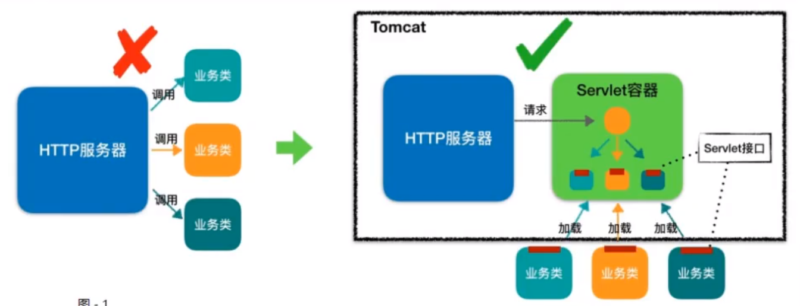

## 说明

## 目录

## tomcat引用外部项目

### 方式一

> 在Tomcat\conf\server.xml中配置
>
> ```xml
> <Host name="www.***.cn" debug="0" appBase="webapps"  
>             unpackWARs="true" autoDeploy="true"  
>             xmlValidation="false" xmlNamespaceAware="false">  
> <Context docBase="D:\\yaodaqing\\workspace\\fc\\WebRoot\\" path=""   
> privileged="true" reloadable="true" caseSensitive="false" debug="0" crossContext="true">  
> </Context>  
> </Host>  
> ```
>
> 配置了此信息，tomcat即可直接读取正在开发的项目。  

### 方式二

> Tomcat\conf\Catalina\localhost
>
> localhost表示具体的域名，也就是<Host name="www.***.cn"这里配置的名字。  
> 在此文件夹里加入一个项目名字.xml的文件。在里面添上：  
> 文件名：fc.xml（fc表示项目）,path为访问路径，一般配置为项目名
> 内容如下：  
>
> ```xml
> <Context docBase="D:\\yaodaqing\\workspace\\fc\\WebRoot\\" path="/fc"   
> privileged="true" reloadable="true" caseSensitive="false" debug="0" crossContext="true"> 
> ```

## tomcat9在idea控制台打印乱码

- 设置-Dfile.encoding=UFT-8是没有用的，需要修改tomcat的日志配置文件logging.properties

  ```xml
  java.util.logging.ConsoleHandler.encoding = GBK
  ```

- 并且不能在任何地方设置-Dfile.encoding=UFT-8

## tomcat目录结构

| 目录    | 目录下文件               | 说明                                                         |
| ------- | ------------------------ | ------------------------------------------------------------ |
| bin     | /                        | 存放tomcat启动、停止等批处理脚本文件                         |
|         | startup.bat,startup.sh   | 用于在windows和linux下的启动脚本                             |
|         | shutdown.bat,shutdown.sh | 用于在windows和linux下的停止脚本                             |
| conf    | /                        | 用于存放tomcat相关配置文件                                   |
|         | Catalina                 | 用于存放对每个虚拟机的context配置                            |
|         | context.xml              | 用于定义所有web应用均需加载的context配置，如果web应用指定了自己的context.xml,该文件将被覆盖 |
|         | catalina.properties      | Tomcat 的环境变量配置                                        |
|         | catalina.policy          | Tomcat 运行的安全策略配置                                    |
|         | logging.properties       | Tomcat 的日志配置文件，可以通过该文件修改Tomcat 的日志级别及日志路径等 |
|         | server.xml               | Tomcat 服务器的核心配置文件                                  |
|         | tomcat-users.xml         | 定义Tomcat默认的用户及角色映射信息配置                       |
|         | web. xml                 | Tomcat 中所有应用默认的部暑描述文件，王要定义了基础servlet和TME映射。 |
| lib     | /                        | Tomcat 服务器的依赖包                                        |
| logs    | /                        | Tomcat 默认的日志存放目录                                    |
| webapps | /                        | Tomcat 默认的web应用部署日录                                 |
| work    | /                        | Web应用JSP代码生成和编译的临时目录                           |

## tomcat启动停止

启动

```
双击 bin/startup.bat
```

停止

```
双击 bin/shutdown.bat
```

## tomcat源码运行

### 创建工程

> - 下载源码压缩包，idea创建一个empty prohect,将源码包解压到该目录
> - 进入解压后的目录，创建home目录，然后将conf目录和webapps目录移动到home目录下

### 新建pom.xml文件

```xml
<?xml version="1.0" encoding="UTF-8"?>
<project xmlns="http://maven.apache.org/POM/4.0.0"
         xmlns:xsi="http://www.w3.org/2001/XMLSchema-instance"
         xsi:schemaLocation="http://maven.apache.org/POM/4.0.0 http://maven.apache.org/xsd/maven-4.0.0.xsd">
 
    <modelVersion>4.0.0</modelVersion>
    <groupId>org.apache.tomcat</groupId>
    <artifactId>Tomcat8.5</artifactId>
    <name>Tomcat8.5</name>
    <version>8.5</version>
 
    <build>
        <finalName>Tomcat8.5</finalName>
        <sourceDirectory>java</sourceDirectory>
        <testSourceDirectory>test</testSourceDirectory>
        <resources>
            <resource>
                <directory>java</directory>
            </resource>
        </resources>
        <testResources>
           <testResource>
                <directory>test</directory>
           </testResource>
        </testResources>
        <plugins>
            <plugin>
                <groupId>org.apache.maven.plugins</groupId>
                <artifactId>maven-compiler-plugin</artifactId>
                <version>2.3</version>
                <configuration>
                    <encoding>UTF-8</encoding>
                    <source>1.8</source>
                    <target>1.8</target>
                </configuration>
            </plugin>
        </plugins>
    </build>
 
    <dependencies>
        <dependency>
            <groupId>junit</groupId>
            <artifactId>junit</artifactId>
            <version>4.12</version>
            <scope>test</scope>
        </dependency>
        <dependency>
            <groupId>org.easymock</groupId>
            <artifactId>easymock</artifactId>
            <version>3.4</version>
        </dependency>
        <dependency>
            <groupId>ant</groupId>
            <artifactId>ant</artifactId>
            <version>1.7.0</version>
        </dependency>
        <dependency>
            <groupId>wsdl4j</groupId>
            <artifactId>wsdl4j</artifactId>
            <version>1.6.2</version>
        </dependency>
        <dependency>
            <groupId>javax.xml</groupId>
            <artifactId>jaxrpc</artifactId>
            <version>1.1</version>
        </dependency>
        <dependency>
            <groupId>org.eclipse.jdt.core.compiler</groupId>
            <artifactId>ecj</artifactId>
            <version>4.5.1</version>
        </dependency>
       
    </dependencies>
</project>
```

### idea导入项目


### 启动tomcat源码

> - 找到主类org.apache.catalina.startup.Bootstrap
>
> - 配置启动类参数
>
>   ```
>   -Dcatalina.home=E:/idea/tomcat001/apache-tomcat-8.5.53-src/home
>   -Dcatalina.base=E:/idea/tomcat001/apache-tomcat-8.5.53-src/home
>   -Djava.util.logging.manager=org.apache.juli.ClassLoaderLogManager
>   -Djava.util.logging.config.file=E:/idea/tomcat001/apache-tomcat-8.5.53-src/home/conf/logging.properties
>   ```
>
> - 

### 浏览器访问localhost:8080


> 出现上述异常的原因，是我们直接启动org.apache.catalina.startup.Bootstrap的时候没有加载Jasper_nitializer，从而无法编译JSP。解决办法是在tomcat的源码contextConfig中的configurestart函数中手动将JSP解析器初始化:
>
> 

### 其它问题

#### 乱码

> - 解决办法：-Dfile.encoding=utf-8
>   -Duser.language=en
>   -Duser.region=US


## tomcat架构

### http工作原理

> HTTP协议是浏览器与服务器之间的数据传送协议。作为应用层协议，HTTP是基于TCP/IP协议来传递数据的(HTM文件、图片、查询结果等)，HTTP协议不涉及数据包(Packet)传输，主要规定了客户端和服务器之间的通信格式。
>
> 
> 从图上你可以看到，这个过程是:
>
> ```
> 1)用户通过浏览器进行了一个操作，比如输入网址并回车，或者是点击链接，接着浏览器获取了这个事件。
> 2)浏览器向服务端发出TcP连接请求。
> 3) 服务程序接受浏览器的连接请求，并经过Tcp三次握手建立连接。
> 4) 浏览器将请求数据打包成一个HTTP协议格式的数据包。
> 5)浏览器将该数据包推入网络，数据包经过网络传输，最终达到服务端程序。
> 6) 服务端程序拿到这个数据包后，同样以HTTP协议格式解包，获取到客户端的意图。
> 7)得知客户端意图后进行处理，比如提供静态文件或者调用服务端程序获得动态结果。
> 8)服务器将响应结果(可能是HTML或者图片等)按照HTTP协议格式打包。
> 9)服务器将响应数据包推入网络，数据包经过网络传输最终达到到浏览器。
> 10) 浏览器拿到数据包后，以HTTP协议的格式解包，然后解析数据，假设这里的数据是HTML。
> 11)浏览器将HTML文件展示在页面上。
> 那我们想要探究的Tomcat和Jetty作为一个HTTP服务器，在这个过程中都做了些什么事情呢?主要是接受连接、解析请求数据、处理请求和发送响应这几个步骤。
> ```
>
> 

### tomcat整体架构

#### http服务器请求处理

> 浏览器发给服务端的是一个HTTP格式的请求，HTTP服务器收到这个请求后，需要调用服务端程序来处理，所谓的服务端程序就是你写的Java类，一般来说不同的请求需要由不同的Java类来处理。



> 1)图1，表示HTTP服务器直接调用具体业务类，它们是紧耦合的。
>
> 2)图2，HTTP服务器不直接调用业务类，而是把请求交给容器来处理，容器通过servlet接口调用业务类。因此servlet接口和Servlet容器的出现，达到了HTTP服务器与业务类解耦的目的。而servlet接口和Servlet容器这一整套规范叫作servlet规范。Tomcat按照servlet规范的要求实现了Servlet容器，同时它们也具有HTTP服务器的功能。作为Java程序员，如果我们要实现新的业务功能，只需要实现一个servlet， 并把它注册到Tomcat( servlet容器)中，剩下的事情就由Tomcat帮我们处理了。·

#### servlet容器工作原理

> 为了解耦，HTTP服务器不直接调用servlet，而是把请求交给serv1et容器来处理，那servlet容器又是怎么工作的呢?
>
> ```
> 当客户请求某个资源时，НTTP服务器会用一个servletRequest对象把客户的请求信息封装起来，然后调用servlet容器的service方法，Servlet容器拿到请求后，根据请求的URI和servlet的映射关系，找到相应的servlet，如果servlet还没有被加载，就用反射机制创建这个servlet，并调用servlet的init方法来完成初始化，接着调用servlet的service方法来处理请求，把servletResponse对象返回给HTTP服务器，HTTP服务器会把响应发送给客户端。
> ```
>
> 

#### tomcat整体架构

> 我们知道如果要设计一个系统，首先是要了解需求，我们已经了解了Tomcat要实现两个核心功能:
>
> ```
> 1）处理socket连接，负责网络字节流与Request和Response对象的转化。
> 2)加载和管理servlet，以及具体处理Request请求。
> 因此Tomcat设计了两个核心组件连接器(Connector）和容器(Container)来分别做这两件事情。连接器负责对外交流，容器负责内部处理。
> ```
>
> 
>
> 

### 连接器-Coyote

#### 架构介绍

> - Coyote 是Tomcat的连接器框架的名称，是Tomcat服务器提供的供客户端访问的外部接口。客户端通过coyote与服务器建立连接、发送请求并接受响应
> - Coyote 封装了底层的网络通信(socket 请求及响应处理)，为catalina 容器提供了统一的接口，使Catalina 容器与具体的请求协议及工o操作方式完全解耦。coyote 将socket 输入转换封装为 Request 对象，交由Catalina 容器进行处理，处理请求完成后，Catalina 通过coyote提供的Response 对象将结果写入输出流。
> - coyote作为独立的模块，只负责具体协议和IO的相关操作，与servlet 规范实现没有直接关系，因此即便是 Request 和Response对象也并未实现servlet规范对应的接口，而是在catalina 中将他们进一步封装为ServletRequest 和ServletResponse。
>
> 
>
> 

#### IO模型与协议

> 在coyote中, Tomcat支持的多种/o模型和应用层协议，具体包含哪些o模型和应用层协议，请看下表:

Tomcat 支持的工o模型(自8.5/9.0 版本起，Tomcat移除了对BIO 的支持):

| IO模型 | 描述                                                         |
| ------ | ------------------------------------------------------------ |
| NIO    | 非阻塞I/O，采用Java NIo类库实现。                            |
| NIO2   | 异步I/O，采用JDK 7最新的NIo2类库实现。                       |
| APR    | 采用Apache可移植运行库实现，是c/c++编写的本地库。如果选择该方案，需要单独安装APR库。 |

Tomcat 支持的应用层协议 :

| 应用层协议 | 描述                                                         |
| ---------- | ------------------------------------------------------------ |
| HTTP/1.1   | 这是大部分web应用采用的访问协议。                            |
| AJP        | 用于和web服务器集成(如Apache ），以实现对静态资源的优化以及集群部署，当前支持AJP/1.3。 |
| HTTP/2     | HTTP 2.0大幅度的提升了web性能。下一代HTTP协议，自8.5以及9.0版本之后支持。 |

协议分层


> - 在8.0之前，Tomcat 默认采用的I/0方式为 BIO ，之后改为 NIO。无论 NIo、NO2 还是 APR，在性能方面均优于以往的BIO。如果采用APR，甚至可以达到 Apache HTTp Server 的影响性能。
> - Tomcat为了实现支持多种I/0模型和应用层协议，一个容器可能对接多个连接器，就好比一个房间有多个门。但是单独的连接器或者容器都不能对外提供服务，需要把它们组装起来才能工作，组装后这个整体叫作service组件。这里请你注意，Service本身没有做什么重要的事情，只是在连接器和容器外面多包了一层，把它们组装在一起。Tomcat内可能有多个service，这样的设计也是出于灵活性的考虑。通过在Tomcat中配置多个service，可以实现通过不同的端口号来访问同一台机器上部署的不同应用。

#### 连接器组件


连接器中的各个组件的作用如下:

EndPoint

> - Endpoint : coyote 通信端点，即通信监听的接口，是具体socket接收和发送处理器，是对传输层的抽象，因此EndPoint用来实现TCP/IP协议的。
> -  Tomcat 并没有EndPoint 接口，而是提供了一个抽象类AbstractEndpoint ，里面定义了两个内部类:Acceptor和SocketProcessor，Acceptor用于监听socket连接请求。socketprocessor用于处理接收到的socket请求，它实现Runnab1e接口，在run方法里调用协议处理组件Processor进行处理。为了提高处理能力，socketProcessor被提交到线程池来执行,而这个线程池叫作执行器(Executor)

Processor

> - processor : Coyote 协议处理接口，如果说EndPoint是用来实现TCP/IP协议的，那么Processor用来实现HTTP协议，processor接收来自Endpoint的Socket，读取字节流解析成Tomcat Request和Response对象，并通过Adapter将其提交到容器处理，Processor是对应用层协议的抽象。

ProtocolHandler

> - protocolHandler : Coyote 协议接口，通过Endpoint 和 Processor ，实现针对具体协议的处理能力。Tomcat 按照协议和I/O提供了6个实现类：AjpNioProtocol , AjpAprProtocol,AjpNio2Protocol , Http11NioProtocol,Http11Nio2Protocol, Http11AprProtocol。我们在配置tomcat/conf/server.xml时，至少要指定具体的protocolHandler ，当然也可以指定协议名称，如: HTTP/1.1 ，如果安装了APR，那么将使用Http11AprProtocol ，否则使用 Http11NioProtocol.

Adapter

> - 由于协议不同，客户端发过来的请求信息也不尽相同，Tomcat定义了自己的Request类来"存放”这些请求信息。ProtocolHandler接口负责解析请求并生成Tomcat Request类。但是这个Request对象不是标准的servletRequest，也就意味着，不能用Tomcat Request作为参数来调用容器。Tomcat设计者的解决方案是引入CoyoteAdapter,这是适配器模式的经典运用，连接器调用coyoteAdapter的Sevice方法，传入的是Tomcat Request对象，Coyotendapter负责将Tomcat Request转成servletRequest，再调用容器的Service方法。

### 容器 - Catalina

> tomcat是一个由一系列可配置的组件构成的web容器，而catalina是Tomcat的servlet容器。Catalina 是servlet 容器实现，包含了之前讲到的所有的容器组件，以及后续章节涉及到的安全、会话、集群、管理等servlet 容器架构的各个方面。它通过松耦合的方式集成coyote，以完成按照请求协议进行数据读写。同时，它还包括我们的启动入口、shell程序等。

#### Catalina的地位

Tomcat模块分层结构图如下：


从tomcat源码包结构也可以看出其各个模块

> Tomcat 本质上就是一款 servlet 容器，因此catalina 才是 Tomcat 的核心，其他模块都是为Catalina提供支撑的。比如通过coyote 模块提供链接通信，Jasper 模块提供Jsp引擎，Naming 提供JNDI 服务，Juli提供日志服务。

#### Catalina的结构


如上图所示，Catalina负责管理server, 而server表示着整个服务器。Server下面有多个服务service,每个服务都包含着多个连接器组件connector ( coyote 实现)和一个容器组件container。 在Tomcat 启动的时候，会初始化一个Catalina的实例。

**Catalina各个组件的职责**

| 组件      | 职责                                                         |
| --------- | ------------------------------------------------------------ |
| Catalina  | 负责解析Tomcat的配置文件，以此来创建服务器server组件，并根据命令来对其进行管理 |
| Server    | 服务器表示整个catalina servlet容器以及其它组件，负责组装并启动servlet引擎，Tomcat连接器。 Server通过实现Iifecycle接口，提供了一种优雅的启动和关闭整个系统的方式， |
| Service   | 服务是server内部的组件，一个server包含多个service。它将若干个Connector组件绑定到一个ContainerI( Engine )上 |
| Connector | 连接器，处理与客户端的通信，它负责接收客户请求，然后转给相关的容器处理，最后向客户返回响应结果 |
| Container | 容器，负责处理用户的servlet请求，并返回对象给web用户的模块   |

#### Container结构

> Tomcat设计了4种容器，分别是Engine、Host, Context和Wrapper。这4种容器不是平行关系，而是父子关系。，Tomcat通过一种分层的架构，使得servlet容器具有很好的灵活性。


各个组件的含义：

| 容器    | 描述                                                         |
| ------- | ------------------------------------------------------------ |
| Engine  | 表示整个Catalina的servlet引擎，用来管理多个虚拟站点，一个service最多只能有一个Engine，但是一个引擎可包含多个Host |
| Host    | 代表一个虚拟主机，或者说一个站点，可以给Tomcat配置多个虚拟主机地址，而一个虚拟主机下可包含多个context |
| Context | 表示一个web应用程序，一个web应用可包含多个Wrapper            |
| Wrapper | 表示一个servlet,Wrapper 作为容器中的最底层，不能包含子容器   |

> 我们也可以再通过Tomcat的server.xml配置文件来加深对Tomcat容器的理解。Tomcat采用了组件化的设计，它的构成组件都是可配置的，其中最外层的是server,其他组件按照一定的格式要求配置在这个顶层容器中。


> 那么，Tomcat是怎么管理这些容器的呢?你会发现这些容器具有父子关系，形成一个树形结构，你可能马上就想到了设计模式中的组合模式。没错，Tomcat就是用组合模式来管理这些容器的。具体实现方法是，所有容器组件都实现了Container接口，因此组合模式可以使得用户对单容器对象和组合容器对象的使用具有一致性。这里单容器对象指的是最底层的Wrapper，组合容器对象指的是上面的context、Host或Engine


Container容器提供了一系列方法


在上面的接口看到了getParent, setParent、 addChild和removeChild等方法。

Container接口扩展了Iifecycle接口，Iifecycle接口用来统一管理各组件的生命周期

