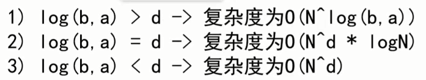

## 说明

## 目录

## 时间复杂度

### 常数时间的操作

> - 一个操作如果和样本的数据量没有关系，每次都是固定时间内完成的操作，叫做常数操作，**如常用的4则运算，位运算，数组取第i个元素等都是常数操作,而链表取第i个元素就需要从头挨个遍历，就与数据量相关，它就不是一个常数操作**
> - 常用O(读作big O)来表示复杂度，通常表示算法的**最坏情况下**的时间复杂度

### 时间复杂度的计算

> 在表达式中，只要高阶项，不要低阶项，也不要高阶项的系数，剩下的部分如果为f(N)，那
> 么时间复杂度为O(f(N))。
>
> **以选择排序法为例**：
>
> ```
> 第一次循环：读取每个数，次数为n次，每个数与第一个数进行比较，次数为n，将最小值与第1个数交换，次数为1，总的次数为n+n+1
> 第二次循环：读取每个数，次数为n-1次，每个数与第2个数进行比较，次数为n-1，将最小值与第2个数交换，次数为1，总的次数为(n-1)+(n-1)+1
> ......
> 总的次数：a*n^2+b*n+c,根据规则，只保留高阶项，则选择排序法的时间复杂度为O(n^2)
> ```
>
> 

### 算法的评估

> 评价一个算法流程的好坏，先看时间复杂度的指标，然后再分析不同数据样本下的实际运行
> 时间，也就是“常数项时间”

## 额外空间复杂度

> 即算法实现过程中需要开辟的额外空间复杂度
>
> 以选择排序为例，额外空间复杂度为O(1)，只需要2个for循环的index变量+一个最小值的索引变量（每次循环都会释放）+1个交换时的临时变量(每次循环都会释放)，

## 异或运算

### 基础

> - 符号：^
>
> - 运算规则：2个二进制位进行异或运算，相同为0，不同为1，也可以理解为**不进位的加法**
>
>   | 运算 | 结果 |
>   | ---- | ---- |
>   | 1^1  | 0    |
>   | 1^0  | 1    |
>   | 0^1  | 1    |
>   | 0^0  | 0    |
>
> - 性质：使用不进位加法解释交换律和结合律，同一个二进制位上1的个数为奇数个，则结果的该二进制位为1，否则为0
>
>   - 0 ^ N = N   ,  N ^ N = 0
>   - 满足交换律：a^b = b^a
>   - 满足结合律：a^b^c = a^(b^c)
>
> - 基于异或运算实现**2数交换**
>
>   注意：前提是a,b两个变量的内存区域不同，即不是同一个变量，**如数组的i和j两个位置进行交换，若i和j相等，就会将i位置的值变为0**
>
>   ```java
>   有两个数a,b,进行如下操作即可实现交换
>   a = a ^ b;
>   b = a ^ b;
>   a = a ^ b;
>   ```

### 面试题

#### 题目1

> 有一个数组有n种数，其中只有1种数出现奇数次，其它数都出现偶数次，找到出现奇数次的数

```java
public int findOne(int[] arr) {
    if (arr == null || arr.length == 0) {
        throw new IllegalArgumentException("array is empty!");
    }

    int result = 0;
    for (int i : arr) {
        result ^= i;
    }

    return result;
}
```

#### 题目2

> 有一个数组有n种数，其中只有2种数出现奇数次，其它数都出现偶数次，找到这2个出现奇数次的数

**思路**

> 1. 假设2个数为a和b，**a!=b,  a^b!=0**
> 2. 类似题目1，可以得到  t1 = a^b，由于a^b!=0，所以t1必定有一个二进制位不等于0，则a和b的某个二进制位不同，此时我们将数组中的数分为2类，第一类为指定二进制位为1，第二类为指定二进制位为0，这里就会把a和b分别分到2个类别去
> 3. 分类1的数进行亦或，最终的结果 t2即为a或者b
> 4. 由t1^t2即可得到另一个数

## 插入排序

### 步骤

> 每次循环保证0~i范围内出数有序，以从小大大排序为例，即i位置的数a依次与其前面的数进行比较，若i位置的数小于前面的数，则进行交换，知道找到不小于a的数或到达数组开头为止

### 时间复杂度

> - 数组[7,6,5,4,3,2,1],其时间复杂度为O（N^2）,每次i位置的数都需要与前面的所有数进行比较交换
> - 数组[1,2,3,4,5,6,7],其时间复杂度为O（N），每次i位置的数只需要与其前面一个数进行比较
> - 所以插入排序的时间复杂度为O（N^2）

### 代码实现

```java
public int[] insertSort(int[] arr) {
    if (arr == null || arr.length == 0) {
        return arr;
    }
    for (int i = 1; i < arr.length; i++) {
        for (int j = i - 1; j >= 0 && arr[j] > arr[j + 1]; j--) {
            swap(arr, j, j + 1);
        }
    }
    return arr;
}

/**
 * i和j必须不同，否则会将arr数组的i位置值变为0
 */
public void swap(int[] arr, int i, int j) {
    arr[i] = arr[i] ^ arr[j];
    arr[j] = arr[i] ^ arr[j];
    arr[i] = arr[i] ^ arr[j];
}
```

## 二分查找详解与扩展

### 有序数组查询某个数是否存在

> 数组是有序的，每次进行二分，比较中间的数与目标数是否相等，直到数组不可二分为止，其时间复杂度为O（logN），以2为底的对数

### 在有序数组中找到>=某个数最左侧的位置

> 二分到不可拆分为止即可找到，其时间复杂度为O（logN）

### 局部最小值问题

> 给定一个无序数组，任意2个相邻的数不相等
>
> 局部最小的定义
>
> ```
> 给定数组int[] arr
> 1. 对于0号索引的元素，只需要arr[0]<arr[1],即为局部最小
> 2. 对于N-1号索引的元素,只需要arr[N-2]>arr[N-1],即为局部最小
> 3. 对于其它的索引i,需要满足arr[i-1]>arr[i]<arr[i+1],即为局部最小
> ```
>
> 在数组中找局部最小值
>
> ```
> 1. 先看索引0位置的数是否为局部最小，若是则直接返回
> 2. 看索引N-1位置的数是否为局部最小，若是则直接返回
> 3. 步骤1,2都没有找到，说明在0~N-1中必然存在一个局部最小值，此时arr[0]>arr[1],arr[N-2]<arr[N-1],中间必然存在一个拐点
> 4. 使用二分的策略查找局部最小值，若middle位置的值为局部最小，则直接返回，否则在0--middle中必然存在局部最小值，一直二分即可找到
> ```

### 练习题

#### 题目1

> 在一个二维数组中（每个一维数组的长度相同），每一行都按照从左到右递增的顺序排序，每一列都按照从上到下递增的顺序排序。请完成一个函数，输入这样的一个二维数组和一个整数，判断数组中是否含有该整数。
>

##### 解题思路

> 此问题使用类似于二分查找的算法。右上角元素（第一行最后一列）的元素是第一行元素与最后一列元素构成的递增序列的分割点，因为此元素的左面元素都比此元素小，此元素的下面元素都比此元素大（类似于二分查找中的中点位置的元素）。所以每次循环，比较目标元素target与右上角元素的大小关系，如果相等，则找到，返会true即可。如果target元素大于右上角元素，则target大于当前第一行所有元素，所以target不能出现在第一行，所以需要把第一行清除。如果target元素小于右上角元素，则target小于最后一列所有元素，不可能出现在最后一列，所以需要把最后一列清除。清除第一行或者最后一列之后，继续采用上述方法，用右上角元素与target元素进行比较。如果当列数减小到零或者行数增加到最后一行都没有找到target，则返回false，说明此二维数组中没有与target相同的元素

##### 代码

```java
public boolean find(int target, int[][] array) {
    // 初始索引，从右上角开始
    int rowIndex = 0;
    int colIndex = array[0].length - 1;

    // 数组行数
    int rowLength = array.length;

    while (rowIndex < rowLength && colIndex > -1) {
        if (array[rowIndex][colIndex] == target) {
            return true;
        } else if (array[rowIndex][colIndex] > target) {
            colIndex--;
        } else if (array[rowIndex][colIndex] < target) {
            rowIndex++;
        }
    }

    return false;
}
```

## 对数器

### 概念

> 1. 有一个你想要测的方法a
> 2. 实现复杂度不好但是容易实现的方法b
> 3. 实现一个随机样本产生器
> 4. 把方法a和方法b跑相同的随机样本，看看得到的结果是否一样。
> 5. 如果有一个随机样本使得比对结果不一致，打印样本进行人工干预，改对方法a或者方法b
> 6. 当样本数量很多时比对测试依然正确，可以确定方法a已经正确。

### 应用

> 使用对数器测试插入排序
>
> - 编写一个随机数组生成器generateArr
> - 编写插入排序方法insertSort
> - 编写测试方法main，将插入排序与jdk标准排序进行对比

```java
public class MainTest {

    /**
     * 随机生成数组
     *
     * @param maxSize  数组大小
     * @param maxValue 数组每个元素最大值
     */
    public static int[] generateArr(int maxSize, int maxValue) {
        int[] arr = new int[(int) ((maxSize + 1) * Math.random())];
        for (int i = 0; i < arr.length; i++) {
            arr[i] = (int) ((maxValue + 1) * Math.random()) - (int) ((maxValue + 1) * Math.random());
        }
        return arr;
    }

    public static void insertSort(int[] arr) {
        if (arr == null || arr.length == 0) {
            return;
        }
        for (int i = 1; i < arr.length; i++) {
            for (int j = i - 1; j >= 0 && arr[j] > arr[j + 1]; j--) {
                swap(arr, j, j + 1);
            }
        }
    }

    /**
     * i和j必须不同，否则会将arr数组的i位置值变为0
     */
    public static void swap(int[] arr, int i, int j) {
        arr[i] = arr[i] ^ arr[j];
        arr[j] = arr[i] ^ arr[j];
        arr[i] = arr[i] ^ arr[j];
    }

    public static void main(String[] args) throws InterruptedException {
        int testTime = 1000;
        int maxSize = 100;
        int maxValue = 100;
        boolean success = true;
        for (int i = 0; i < testTime; i++) {
            int[] arr1 = generateArr(maxSize, maxValue);
            int[] arr2 = Arrays.copyOf(arr1, arr1.length);
            //插入排序
            insertSort(arr1);
            //jdk内置排序
            Arrays.sort(arr2);
            if (!Arrays.equals(arr1, arr2)) {
                success = false;
                break;
            }
        }

        System.out.println(success);

    }
}
```

## 递归

### 使用递归求数组最大值

```java
public int findArrMax(int[] arr) {
    return findMax(arr, 0, arr.length - 1);
}

public int findMax(int[] arr, int left, int right) {
    if (left == right) {
        return arr[left];
    }

    // 防止left+right溢出
    int middle = left + ((right - left) >> 1);

    int leftMax = findMax(arr, left, middle);
    int rightMax = findMax(arr, middle + 1, right);
    return Math.max(leftMax, rightMax);
}
```

### 递归的时间复杂度估计

> master公式
>
> T(N) = a*T(N/b) + 0(N^d)
>
> - T(N):表示母问题，N为数据规模
> - a：一层递归中子问题的个数，在上面的数组求最大值中为2
> - T(N/b):表示子问题，b表示子问题的规模，在上面的数组求最大值中为2
> - 0(N^d):表示除了递归操作，其它操作的时间复杂度，在上面的数组求最大值中为0(1)
> - 所以上面的数组求最大值时间复杂度为0(N)
>
> 

## 认识O(NlogN)的排序

### 归并排序

> - 整体就是一个简单递归，左边排好序、右边排好序、让其整体有序
> - 让其整体有序的过程里用了排外序方法
> - 利用master公式来求解时间复杂度
> - 归并排序的实质
> - 时间复杂度0 (N* logN)，额外空间复杂度0 (N)