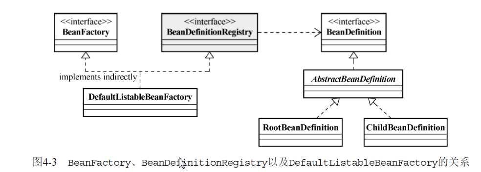

# IOC的基本概念

> 1. IOC的理念：让别人为你服务，之前是需要什么东西自己去拿，现在是需要什么东西让别人送过来
>
> 2. 通知IOC容器的3种方式：构造器注入、setter方法注入、接口注入
>
>    > 接口注入：从注入方式的使用上来说，接口注入是现在不甚提倡的一种方式，基本处于“退 役状态”。因为它强制被注入对象实现不必要的接口，带有侵入性。而构造方法注入和setter 方法注入则不需耍如此
>    >
>    > 构造方法注入：这种注入方式的优点就是，对象在构造完成之后，即已进入就绪状态，可以 马上使用。缺点就是，当依赖对象比较多的时候，构造方法的参数列表会比较长。而通过反 射构造对象的时候，对相同类型的参数的处理会比较闲难，维护和使用上也比较麻烦。而且 在Java中构造方法无法被继承，无法设置默认值。对于非必须的依赖处理，可能需耍引入多 个构造方法，而参数数量的变动可能造成维护上的不便
>    >
>    > setter方法注入：因为方法可以命名，所以setter方法注入在描述性上要比构造方法注入好一些。 另外，setter方法可以被继承，允许设用默认值，而且有良好的IDE支持。缺点当然就是对象无 法在构造完成后马上进入就绪状态
>    >
>    > 综上所述，构造方法注入和setter方法注入因为其侵入性较弱，且易于理解和使用,所以是现在使 用最多的注入方式；而接口注入因为侵入性较强，近年来已经不流行了

# IOC Service Provider



> `BeanFactory`:定义如何从容器中获取指定的bean或bean相关的信息
>
> `BeanDefinitionRegistry`:定义如何将一个bean注册到ioc容器中
>
> `DefaultListableBeanFactory`：是一个默认实现，提供了基础的功能
>
> `BeanDefinition`:与一个需要注册到容器中的bean对应，描述了该bean的class类型、是否是抽象类、构造方法参数、属性等，`RootBeanDefinition`和`ChildBeanDefinition`是2个主要的实现类

## 外部配置文件方式

> 1. `spring`支持`properties`和`xml`这两张方式的配置文件，针对不同的配置，`spring`使用不同的`BeanDefinitionReader`类来读取加载配置文件，`BeanDefinitionReader`会将读取到的内容映射到`BeanDefinition`，然后注册到`BeanDefinitionRegistry`，之后`BeanDefinitionRegistry`负责bean的注册和初始化，最后就可以使用了。
>
> 2. `PropertiesBeanDefinitionReader`:用于properties
>
> 3. `XmlBeanDefinitionReader`:用于xml，spring在`DefaultListableBeanFactory`的基础上构建了简化xml格式配置加载的`XmlBeanFactory`
>
>    ```java
>    new XmlBeanFactory(new ClassPathResource("config.xml"))
>    ```

## xml配置文件元素
