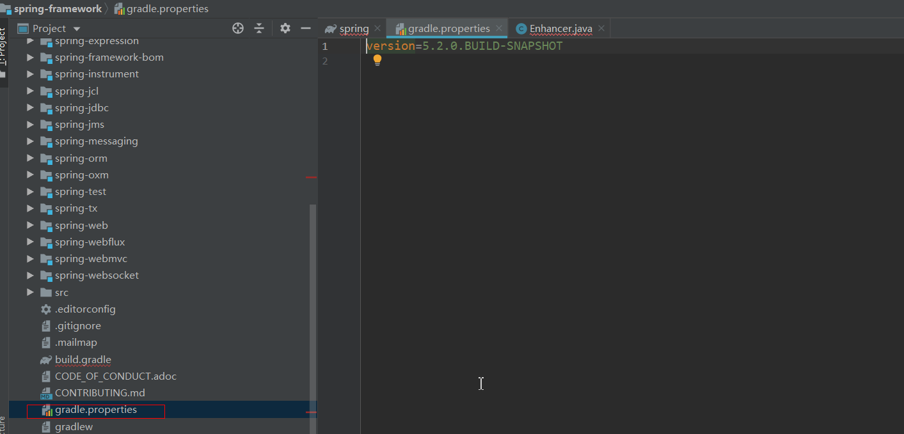
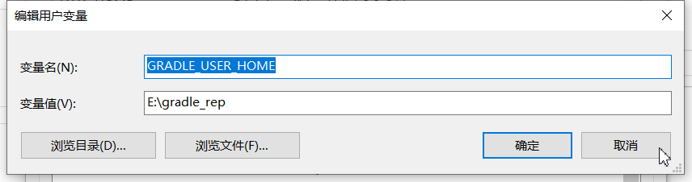
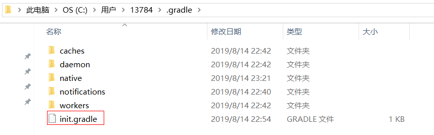
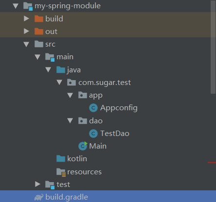
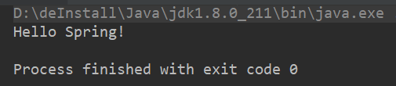

## 说明

## 目录

## 构建spring源码工程

### 下载spring源码包

> 源码版本为5.0，从github下载源码压缩包

### 安装gradle

> spring源码使用gradle作为构建构建，gradle是新一代的构建工具，比maven更加简洁明了
>
> 下载是需要下载和spring源码匹配的gradle，版本可在spring源码的gradle.properties查看
>
> 

#### 配置环境变量

gradle压缩包解压后需要配置环境变量，GRADLE_HOME,PATH

#### 配置本地仓库路径

> 新建环境变量GRADLE_USER_HOME指向仓库路径即可



#### 配置阿里云镜像

在$user/.gradle下新建文件init.gradle



```
allprojects{
    repositories {
        def ALIYUN_REPOSITORY_URL = 'http://maven.aliyun.com/nexus/content/groups/public'
        def ALIYUN_JCENTER_URL = 'http://maven.aliyun.com/nexus/content/repositories/jcenter'
        all { ArtifactRepository repo ->
            if(repo instanceof MavenArtifactRepository){
                def url = repo.url.toString()
                if (url.startsWith('https://repo1.maven.org/maven2')) {
                    project.logger.lifecycle "Repository ${repo.url} replaced by $ALIYUN_REPOSITORY_URL."
                    remove repo
                }
                if (url.startsWith('https://jcenter.bintray.com/')) {
                    project.logger.lifecycle "Repository ${repo.url} replaced by $ALIYUN_JCENTER_URL."
                    remove repo
                }
            }
        }
        maven {
                url ALIYUN_REPOSITORY_URL
            url ALIYUN_JCENTER_URL
        }
    }
}
```

- 

### 测试spring框架

1. 新建模块`my-spring-module`,添加spring-context依赖

   ```java
   dependencies {
       compile (project(":spring-context"))
       testCompile group: 'junit', name: 'junit', version: '4.12'
   }
   ```

2. 创建测试包和类

   

   Appconfig.java

   ```java
   @Configuration
   @ComponentScan("com.sugar.test")
   public class Appconfig {
   }
   ```

   TestDao.java

   ```java
   @Repository
   public class TestDao {
   
      public void query() {
         System.out.println("Hello Spring!");
      }
   }
   ```

   Main.java

   ```java
   public class Main {
      public static void main(String[] args) {
         AnnotationConfigApplicationContext annotationConfigApplicationContext = new AnnotationConfigApplicationContext(Appconfig.class);
         TestDao testDao = annotationConfigApplicationContext.getBean(TestDao.class);
         testDao.query();
      }
   }
   ```

3. 运行

   

4. 


