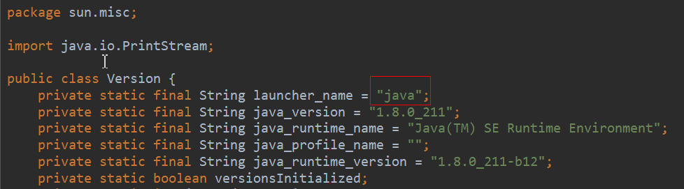
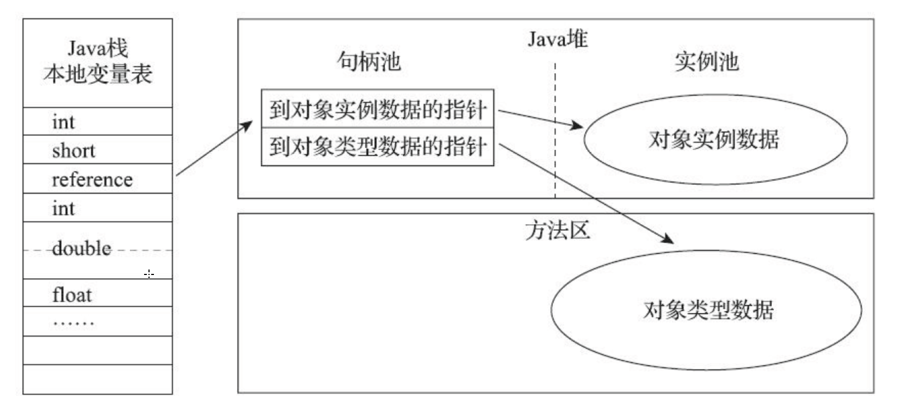
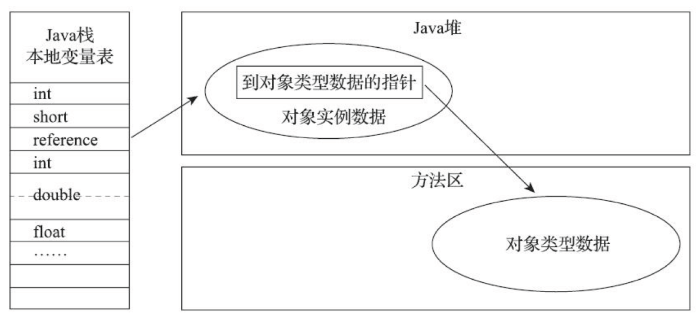

## 说明

## 目录

## 自己编译jdk

系统：linux centos6.8

### 获取源码

> - 下载地址：https://hg.openjdk.java.net/jdk/jdk12/，点击左侧Browse-->zip即可下载源码压缩包
> - 

## java内存区域与内存溢出异常

### 运行时数据区域

> - 常说的**运行时异常**（Runtime Exception）就是发生在这里的异常


### 程序计数器

> - 也叫PC寄存器，占用内存较小，它可以看作是当前线程所执行的字节码的**行号指示器**。
> - **字节码解释器**工作时就是通过改变这个计数器的值来选取下一条需要执行的字节码指令，它是**程序控制流**的指示器
> - 为了线程切换后能恢复到正确的执行位置，每条线程都有一个独立的程序计数器，所以是**线程私有**的
> - 对于一个java方法，这个计数器记录的是正在执行的虚拟机字节码指令的地址；但是对于**native方法**，计数器的值为空
> - 此内存区域是唯一一个在《Java虚拟机规范》中没有规定任何OutOfMemoryError情况的区域。

### Java虚拟机栈

> - 线程私有
> - 虚拟机栈描述的是Java方法执行的线程内存模型：每个方法被执行的时候，Java虚拟机都会同步创建一个栈帧（Stack Frame）用于存储**局部变量表、操作数栈、动态连接、方法出口**等信息。每一个方法被调用直至执行完毕的过程，就对应着一个栈帧在虚拟机栈中从入栈到出栈的过程
> - 对这个内存区域规定了两类异常状况：如果线程请求的栈深度大于虚拟机所允许的深度，将抛出**StackOverflowError**异常；如果Java虚拟机栈容量可以动态扩展[2]，当栈扩展时无法申请到足够的内存会抛出**OutOfMemoryError**异常。

#### 局部变量表

<https://blog.csdn.net/liu20111590/article/details/79001581>

> - 主要保存函数的参数以及局部的变量信息。局部变量表中的变量作用域是当前调用的函数。函数调用结束后，随着函数栈帧的销毁。局部变量表也会随之销毁，释放空间。

#### 操作数栈

<https://blog.csdn.net/qq_28666081/article/details/85269879>

> - 与局部变量表一样，均以字长为单位的数组。不过局部变量表用的是索引，操作数栈是弹栈/压栈来访问。操作数栈可理解为java虚拟机栈中的一个用于计算的临时数据存储区。
> - 存储的数据与局部变量表一致，含int、long、float、double、reference、returnAddress，操作数栈中byte、short、char压栈前(bipush)会被转为int。
> - 数据运算的地方，大多数指令都在操作数栈弹栈运算，然后结果压栈。
> - java虚拟机栈是方法调用和执行的空间，每个方法会封装成一个栈帧压入栈中。其中里面的操作数栈用于进行运算，当前线程只有当前执行的方法才会在操作数栈中调用指令（可见java虚拟机栈的指令主要取于操作数栈）。
> - int类型在-1~5、-128~127、-32768~32767、-2147483648~2147483647范围分别对应的指令是iconst、bipush、sipush、ldc(这个就直接存在常量池了)

#### 动态连接

<https://blog.csdn.net/weixin_34128411/article/details/88039579>

> 符号引用和直接引用在运行时进行**解析和链接的过程**，叫动态链接。
>
> - 一个方法调用另一个方法，或者一个类使用另一个类的成员变量时，
>   - 需要知道其名字
> - 符号引用就相当于名字，
>   - 这些被调用者的名字就存放在Java字节码文件里（.class 文件）。
> - 名字是知道了，但是Java真正运行起来的时候，如何靠这个名字（符号引用）找到相应的类和方法
>   - 需要解析成相应的直接引用，利用直接引用来准确地找到。

#### returnAddress

<https://blog.csdn.net/antony1776/article/details/89843145>

> - returnAddress 数据只存在于字节码层面，与编程语言无关，也就是说，我们在 Java 语言中是不会直接与 returnAddress 类型的数据打交道的。
> - returnAddress 类型的值就是指向特定指令内存地址的指针

### 本地方法栈

> - 线程私有
> - 本地方法栈（Native Method Stacks）与虚拟机栈所发挥的作用是非常相似的，其区别只是虚拟机
>   栈为虚拟机执行Java方法（也就是字节码）服务，而本地方法栈则是为虚拟机使用到的本地（Native）
>   方法服务。、
> - 与虚拟机栈一样，本地方法栈也会在栈深度溢出或者栈扩展失
>   败时分别抛出StackOverflowError和OutOfMemoryError异常

### Java堆

> - 线程共享，在虚拟机启动时创建
> - 对象实例几乎都在这里分配内存
> - 如果在Java堆中没有内存完成实例分配，并且堆也无法再扩展时，Java虚拟机将会抛出OutOfMemoryError异常。

### 方法区

> - 线程共享
> - 它用于存储已被虚拟机加载的类型信息、常量、静态变量、即时编译器编译后的代码缓存等数据
> - 如果方法区无法满足新的内存分配需求时，将抛出OutOfMemoryError异常。
> - 方法区是规范，jdk7之前实现是永久代，jdk8之后替换为元空间

### 运行时常量池

> - 方法区的一部分，Class文件中除了有类的版本、字段、方法、接口等描述信息外，还有一项信息是常量池表（Constant Pool Table），用于存放编译期生成的各种字面量与符号引用，这部分内容将在类加载后存放到方法区的运行时常量池中
> - 一般来说，除了保存Class文件中描述的符号引用外，还会把由**符号引用**翻译出来的**直接引用**也存储在运行时常量池中
> - 既然运行时常量池是方法区的一部分，自然受到方法区内存的限制，当常量池无法再申请到内存时会抛出OutOfMemoryError异常。

#### 符号引用和直接引用

在类的加载过程中的解析阶段，Java虚拟机会把类的二进制数据中的符号引用 替换为 直接引用，如Worker类中一个方法：

```
public void gotoWork(){
     car.run(); //这段代码在Worker类中的二进制表示为符号引用        
}
```

>  在Worker类的二进制数据中，包含了一个对Car类的run()方法的符号引用，它由run()方法的全名 和 相关描述符组成。在解析阶段，Java虚拟机会把这个符号引用替换为一个指针，该指针指向Car类的run()方法在方法区的内存位置，这个指针就是直接引用。

### 直接内存

> - 直接内存（Direct Memory）并不是虚拟机运行时数据区的一部分，也不是《Java虚拟机规范》中
>   定义的内存区域。但是这部分内存也被频繁地使用，而且也可能导致OutOfMemoryError异常出现
> - 在JDK 1.4中新加入了NIO（New Input/Output）类，引入了一种基于通道（Channel）与缓冲区
>   （Buffer）的I/O方式，它可以使用Native函数库直接分配堆外内存，然后通过一个存储在Java堆里面的
>   DirectByteBuffer对象作为这块内存的引用进行操作。这样能在一些场景中显著提高性能，因为避免了
>   在Java堆和Native堆中来回复制数据。
> - 会发生OutOfMemoryError

### 字符串常量池

> - 自JDK 7起，原本存放在永久代的字符串常量池被移至Java堆之中
>
> - ```java
>   public class RuntimeConstantPoolOOM {
>       public static void main(String[] args) {
>           //toString()方法会new一个字符串对象
>           String str1 = new StringBuilder("计算机").append("软件").toString();
>           //常量池保存str1的引用
>           System.out.println(str1.intern() == str1); //true
>   
>           String str2 = new StringBuilder("ja").append("va").toString();
>           System.out.println(str2.intern() == str2); //false
>       }
>   }
>   ```

代码运行结果解析

> - 对于字符串"计算机软件",首先str1是一个对象，intern()方法实现就不需要再拷贝字符串的实例到永久代了，既然字符串常量池已经移到Java堆中，那只需要在常量池里记录一下首次出现的实例引用即可，因此intern()返回的引用和由StringBuilder创建的那个字符串实例就是同一个



## HotSpot虚拟机对象探秘

### 对象的创建

> - 对象所需内存的大小在类加载完成后便可完全确定
> - **指针碰撞**：假设Java堆中内存是绝对规整的，所有被使用过的内存都被放在一边，空闲的内存被放在另一边，中间放着一个指针作为分界点的指示器，那所分配内存就仅仅是把那个指针向空闲空间方向挪动一段与对象大小相等的距离
> - **空闲列表**：但如果Java堆中的内存并不是规整的，已被使用的内存和空闲的内存相互交错在一起，那
>   就没有办法简单地进行指针碰撞了，虚拟机就必须维护一个列表，记录上哪些内存块是可用的，在分
>   配的时候从列表中找到一块足够大的空间划分给对象实例，并更新列表上的记录
> - 当使用Serial、ParNew等带压缩整理过程的收集器时，系统采用的分配算法是指针碰撞，既简单又高效；而当使用CMS这种基于清除(Sweep）算法的收集器时，理论上就只能采用较为复杂的空闲列表来分配内存
> - **本地线程分配缓冲**:是把内存分配的动作按照线程划分在不同的空间之中进行，即每个线程在Java堆中预先分配一小块内存,哪个线程要分配内存，就在哪个线程的本地缓冲区中分配，只有本地缓冲区用完
>   了，分配新的缓存区时才需要同步锁定。虚拟机是否使用TLAB，可以通过-XX：+/-UseTLAB参数来
>   设定。

### 对象的内存布局

> - 对象在堆内存中的存储布局可以划分为三个部分：对象头（Header）、实例数据（Instance Data）和对齐填充（Padding）
> - **对象头**:
>   - 第一类是用于存储对象自身的运行时数据，如哈希码（HashCode）、GC分代年龄、锁状态标志、线程持有的锁、偏向线程ID、偏向时间戳等，这部分数据的长度在32位和64位的虚拟机（未开启压缩指针）中分别为32个比特和64个比特，官方称它为“Mark Word”
>   - 另外一部分是类型指针，即对象指向它的类型元数据的指针，Java虚拟机通过这个指针来确定该对象是哪个类的实例
>   - 并不是所有的虚拟机实现都必须在对象数据上保留类型指针
>   - 如果对象是一个Java数组，那在对象头中还必须有一块用于记录数组长度的数据
> - **实例数据部分**:
>   - 即我们在程序代码里面所定义的各种类型的字段内容，无论是从父类继承下来的，还是在子类中定义的字段都必须记录起来
>   - 相同宽度的字段总是被分配到一起存放，在满足这个前提条件的情况下，在父类中定义的变量会出现在子类之前
> - **对齐填充**:由于HotSpot虚拟机的自动内存管理系统要求对象起始地址必须是8字节的整数倍，换句话说就是任何对象的大小都必须是8字节的整数倍。对象头部分已经被精心设计成正好是8字节的倍数（1倍或者
>   2倍），因此，如果对象实例数据部分没有对齐的话，就需要通过对齐填充来补全

### 对象的访问定位

> - 我们的Java程序会通过栈上的reference数据来操作堆上的具体对象,主流的访问方式主要有使用句柄和直接指针两种
>
> - **句柄**:Java堆中将可能会划分出一块内存来作为句柄池，reference中存储的就
>   是对象的句柄地址，而句柄中包含了对象实例数据与类型数据各自具体的地址信息
>
>   
>
> - **直接指针**:，Java堆中对象的内存布局就必须考虑如何放置访问类型数据的相关信息，reference中存储的直接就是对象地址
>
>   
>
> - 这两种对象访问方式各有优势，使用句柄来访问的最大好处就是reference中存储的是稳定句柄地址，在对象被移动（垃圾收集时移动对象是非常普遍的行为）时只会改变句柄中的实例数据指针，而reference本身不需要被修改

### 实战：OutOfMemoryError异常

> - 在《Java虚拟机规范》的规定里，除了程序计数器外，虚拟机内存的其他几个运行时区域都有发生OutOfMemoryError（下文称OOM）异常的可能

#### Java堆溢出

> - Java堆用于储存对象实例，我们只要不断地创建对象，并且保证GC Roots到对象之间有可达路径来避免垃圾回收机制清除这些对象，那么随着对象数量的增加，总容量触及最大堆的容量限制后就会产生内存溢出异常。

虚拟机参数设置

> -Xms20m -Xmx20m -XX:+HeapDumpOnOutOfMemoryError

**代码**

```java
public class HeapOOM {
    static class OOMObject {
    }

    public static void main(String[] args) {
        List<OOMObject> list = new ArrayList<>();
        while (true) {
            list.add(new OOMObject());
        }
    }
}
```

**异常信息**

```
java.lang.OutOfMemoryError: Java heap space
Dumping heap to java_pid25112.hprof ...
Heap dump file created [29391029 bytes in 0.067 secs]
Exception in thread "main" java.lang.OutOfMemoryError: Java heap space
	at java.util.Arrays.copyOf(Arrays.java:3210)
	at java.util.Arrays.copyOf(Arrays.java:3181)
	at java.util.ArrayList.grow(ArrayList.java:265)
	at java.util.ArrayList.ensureExplicitCapacity(ArrayList.java:239)
	at java.util.ArrayList.ensureCapacityInternal(ArrayList.java:231)
	at java.util.ArrayList.add(ArrayList.java:462)
	at com.sugar.HeapOOM.main(HeapOOM.java:13)

```

**解决办法**

> - 使用jdk自带工具jvisualvm.exe查看生成的hprof文件，查看具体异常的对象,如下图，可以看出创建了大量的OOMObject对象导致OOM
>
>   
>
> - 若是**内存泄漏**，即创建了大量不必要的对象，就需要查看代码bug
>
> - 若是**内存不够**，就需要调整堆的大小-Xmx与-Xms

#### 虚拟机栈和本地方法栈溢出

> - HotSpot虚拟机不支持栈的动态扩展，所以不会oom，只会StackOverflowError
>
> - 设置-Xss128k，然后递归调用方法，就会抛出StackOverflowError
>
> - ```java
>   public class JavaVMStackSOF {
>       private int stackLength = 1;
>   
>       public void stackLeak() {
>           stackLength++;
>           stackLeak();
>       }
>   
>       public static void main(String[] args) throws Throwable {
>           JavaVMStackSOF oom = new JavaVMStackSOF();
>           try {
>               oom.stackLeak();
>           } catch (Throwable e) {
>               System.out.println("stack length:" + oom.stackLength);
>               throw e;
>           }
>       }
>   }
>   ```

#### 方法区和运行时常量池溢出

> 

## 虚拟机参数

| 参数                              | 功能                                                         |
| --------------------------------- | ------------------------------------------------------------ |
| -XX：+HeapDumpOnOutOf-MemoryError | 可以让虚拟机在出现内存溢出异常的时候Dump出当前的内存堆转储快照 |
| -Xms                              | 堆初始化内存大小,单位M                                       |
| -Xmx                              | 堆最大内存大小，单位M                                        |
| -Xoss                             | 设置本地方法栈大小，不会生效                                 |
| -Xss                              | 设置栈容量                                                   |
|                                   |                                                              |
|                                   |                                                              |
|                                   |                                                              |
|                                   |                                                              |

