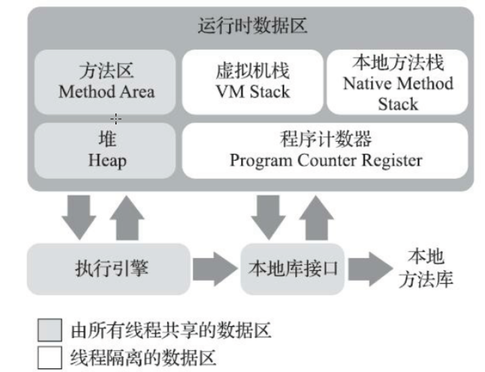

## 说明

## 目录

## 自己编译jdk

系统：linux centos6.8

### 获取源码

> - 下载地址：https://hg.openjdk.java.net/jdk/jdk12/，点击左侧Browse-->zip即可下载源码压缩包
> - 

## java内存区域与内存溢出异常

### 运行时数据区域

> - 常说的**运行时异常**（Runtime Exception）就是发生在这里的异常



### 程序计数器

> - 也叫PC寄存器，占用内存较小，它可以看作是当前线程所执行的字节码的**行号指示器**。
> - **字节码解释器**工作时就是通过改变这个计数器的值来选取下一条需要执行的字节码指令，它是**程序控制流**的指示器
> - 为了线程切换后能恢复到正确的执行位置，每条线程都有一个独立的程序计数器，所以是**线程私有**的
> - 对于一个java方法，这个计数器记录的是正在执行的虚拟机字节码指令的地址；但是对于**native方法**，计数器的值为空
> - 此内存区域是唯一一个在《Java虚拟机规范》中没有规定任何OutOfMemoryError情况的区域。

### Java虚拟机栈

> - 线程私有
> - 虚拟机栈描述的是Java方法执行的线程内存模型：每个方法被执行的时候，Java虚拟机都会同步创建一个栈帧（Stack Frame）用于存储**局部变量表、操作数栈、动态连接、方法出口**等信息。每一个方法被调用直至执行完毕的过程，就对应着一个栈帧在虚拟机栈中从入栈到出栈的过程
> - 对这个内存区域规定了两类异常状况：如果线程请求的栈深度大于虚拟机所允许的深度，将抛出**StackOverflowError**异常；如果Java虚拟机栈容量可以动态扩展[2]，当栈扩展时无法申请到足够的内存会抛出**OutOfMemoryError**异常。

#### 局部变量表

<https://blog.csdn.net/liu20111590/article/details/79001581>

> - 主要保存函数的参数以及局部的变量信息。局部变量表中的变量作用域是当前调用的函数。函数调用结束后，随着函数栈帧的销毁。局部变量表也会随之销毁，释放空间。

#### 操作数栈

<https://blog.csdn.net/qq_28666081/article/details/85269879>

> - 与局部变量表一样，均以字长为单位的数组。不过局部变量表用的是索引，操作数栈是弹栈/压栈来访问。操作数栈可理解为java虚拟机栈中的一个用于计算的临时数据存储区。
> - 存储的数据与局部变量表一致，含int、long、float、double、reference、returnAddress，操作数栈中byte、short、char压栈前(bipush)会被转为int。
> - 数据运算的地方，大多数指令都在操作数栈弹栈运算，然后结果压栈。
> - java虚拟机栈是方法调用和执行的空间，每个方法会封装成一个栈帧压入栈中。其中里面的操作数栈用于进行运算，当前线程只有当前执行的方法才会在操作数栈中调用指令（可见java虚拟机栈的指令主要取于操作数栈）。
> - int类型在-1~5、-128~127、-32768~32767、-2147483648~2147483647范围分别对应的指令是iconst、bipush、sipush、ldc(这个就直接存在常量池了)

#### 动态连接

<https://blog.csdn.net/weixin_34128411/article/details/88039579>

> 符号引用和直接引用在运行时进行**解析和链接的过程**，叫动态链接。
>
> - 一个方法调用另一个方法，或者一个类使用另一个类的成员变量时，
>   - 需要知道其名字
> - 符号引用就相当于名字，
>   - 这些被调用者的名字就存放在Java字节码文件里（.class 文件）。
> - 名字是知道了，但是Java真正运行起来的时候，如何靠这个名字（符号引用）找到相应的类和方法
>   - 需要解析成相应的直接引用，利用直接引用来准确地找到。

#### returnAddress

<https://blog.csdn.net/antony1776/article/details/89843145>

> - returnAddress 数据只存在于字节码层面，与编程语言无关，也就是说，我们在 Java 语言中是不会直接与 returnAddress 类型的数据打交道的。
> - returnAddress 类型的值就是指向特定指令内存地址的指针

### 本地方法栈

> - 线程私有
> - 本地方法栈（Native Method Stacks）与虚拟机栈所发挥的作用是非常相似的，其区别只是虚拟机
>   栈为虚拟机执行Java方法（也就是字节码）服务，而本地方法栈则是为虚拟机使用到的本地（Native）
>   方法服务。、
> - 与虚拟机栈一样，本地方法栈也会在栈深度溢出或者栈扩展失
>   败时分别抛出StackOverflowError和OutOfMemoryError异常

### Java堆

> - 线程共享，在虚拟机启动时创建
> - 对象实例几乎都在这里分配内存
> - 如果在Java堆中没有内存完成实例分配，并且堆也无法再扩展时，Java虚拟机将会抛出OutOfMemoryError异常。

### 方法区

> - 线程共享
> - 它用于存储已被虚拟机加载的类型信息、常量、静态变量、即时编译器编译后的代码缓存等数据
> - 如果方法区无法满足新的内存分配需求时，将抛出OutOfMemoryError异常。
> - 方法区是规范，jdk7之前实现是永久代，jdk8之后替换为元空间

### 运行时常量池

> - 方法区的一部分，Class文件中除了有类的版本、字段、方法、接口等描述信息外，还有一项信息是常量池表（Constant Pool Table），用于存放编译期生成的各种字面量与符号引用，这部分内容将在类加载后存放到方法区的运行时常量池中
> - 一般来说，除了保存Class文件中描述的符号引用外，还会把由**符号引用**翻译出来的**直接引用**也存储在运行时常量池中
> - 既然运行时常量池是方法区的一部分，自然受到方法区内存的限制，当常量池无法再申请到内存时会抛出OutOfMemoryError异常。

#### 符号引用和直接引用

在类的加载过程中的解析阶段，Java虚拟机会把类的二进制数据中的符号引用 替换为 直接引用，如Worker类中一个方法：

```
public void gotoWork(){
     car.run(); //这段代码在Worker类中的二进制表示为符号引用        
}
```

>  在Worker类的二进制数据中，包含了一个对Car类的run()方法的符号引用，它由run()方法的全名 和 相关描述符组成。在解析阶段，Java虚拟机会把这个符号引用替换为一个指针，该指针指向Car类的run()方法在方法区的内存位置，这个指针就是直接引用。

### 直接内存

> - 直接内存（Direct Memory）并不是虚拟机运行时数据区的一部分，也不是《Java虚拟机规范》中
>   定义的内存区域。但是这部分内存也被频繁地使用，而且也可能导致OutOfMemoryError异常出现
> - 在JDK 1.4中新加入了NIO（New Input/Output）类，引入了一种基于通道（Channel）与缓冲区
>   （Buffer）的I/O方式，它可以使用Native函数库直接分配堆外内存，然后通过一个存储在Java堆里面的
>   DirectByteBuffer对象作为这块内存的引用进行操作。这样能在一些场景中显著提高性能，因为避免了
>   在Java堆和Native堆中来回复制数据。
> - 会发生OutOfMemoryError

## HotSpot虚拟机对象探秘